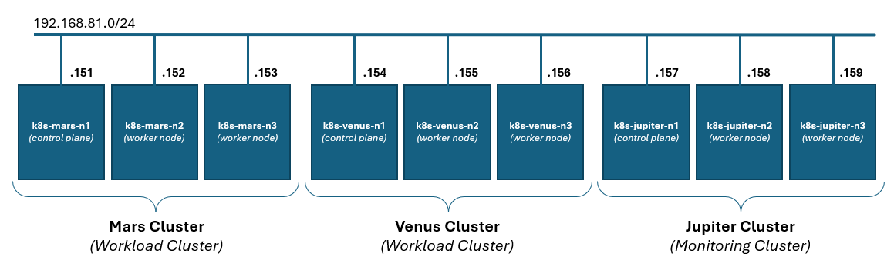

# monitoring-k8s-clusters

Monitoring Kubernetes Clusters - a webinar for DEV.BG held on 30.07.2024

## Supporting files

Files are provided in the following structure:

* *demo* folder contains the supporting manifests files and the actual demo steps

* *slides.pdf* file contains the slides of the presentation

## Video

A recorded demonstration can be found here: <https://youtu.be/chrMVk02ofg>

## Requirements

A station with installed ***kubectl*** and ***helm*** binaries, and access to ***three*** Kubernetes clusters. 

The demo environment configuration looks like this from an infrastructure point of view:

And like this from a workload/component point of view:

The actual demonstration used three Kubernetes clusters created with ***kubeadm***, each having one control plane node and two worker nodes. Of course, a simpler/lighter environment could be used or one created with other means. Depending on the difference, the demo script/steps may need some adjustment.

## Related content

There are a few other related repositories of mine:

* **First Steps with Kubernetes** *(held on 11.02.2021 at SoftUni)* - <https://github.com/shekeriev/softuni-k8s-seminar>

* **A Short Introduction to Kubernetes** *(evolved during time)* - <https://github.com/shekeriev/k8s-intro>

* **The Journey to VMware Tanzu** *(a three part webinar)* - <https://github.com/shekeriev/journey-vmware-tanzu>

* **Kubernetes Network Policies** *(held on 07.01.2022 at DEV.BG)* - <https://github.com/shekeriev/k8s-netpol>

## Need training?

Feel free to contact [me](https://www.linkedin.com/in/dzahariev/) if you or the company you work for needs training on this or related topics.
