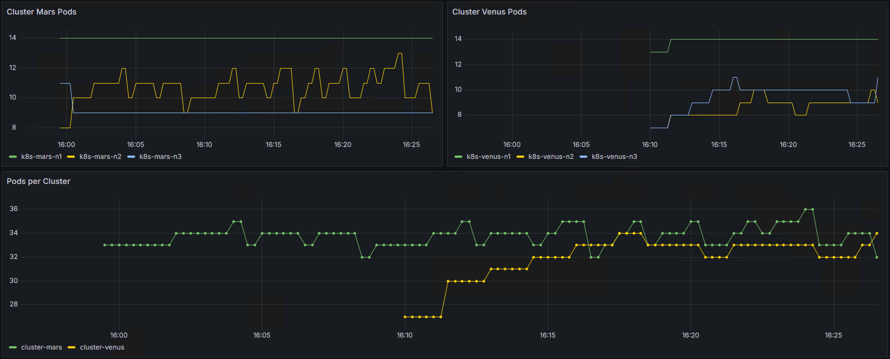
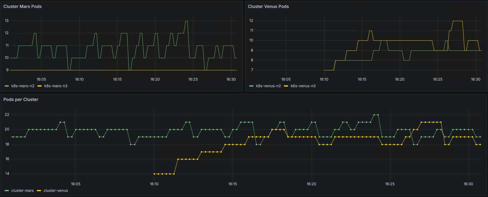
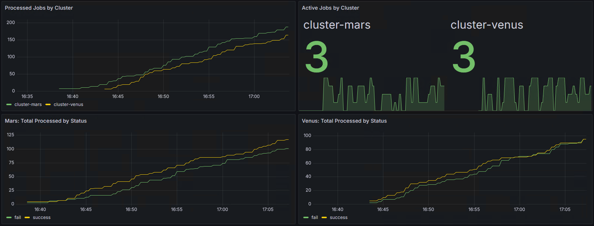
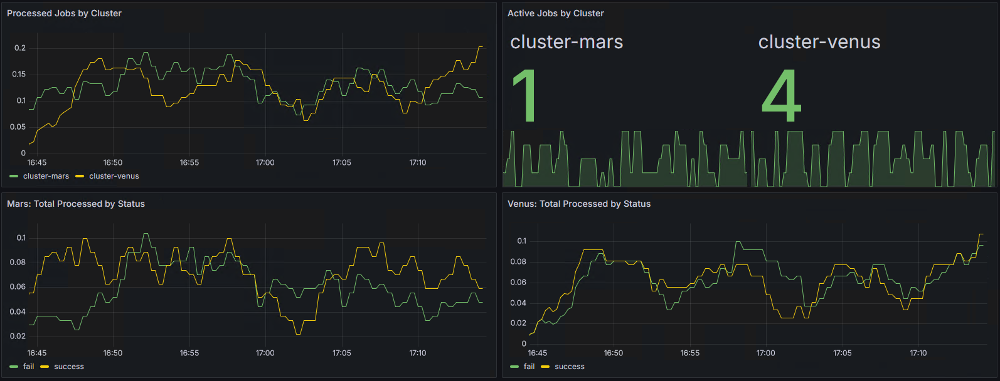

# Demo Script

*Note 1:  It is expected that the workstation already has **kubectl** and **helm** installed. If not, they could be installed by following the steps outlined here for **kubectl** (<https://kubernetes.io/docs/tasks/tools/#kubectl>) and **helm** (<https://github.com/helm/helm/releases>).*

*Note 2: It is expected that on the workstation there are contexts defined for each of the target clusters.*

*Note 3: It is expected that on all the machines there are records in the **hosts** file that allow for proper name resolution.*

Here is the assumed and used during the demonstration structure of the clusters:

- Workload Cluster 1 (Mars)
  - control plane - k8s-mars-n1
  - worker nodes - k8s-mars-n2 and k8s-mars-n3

- Workload Cluster 2 (Venus)
  - control plane - k8s-venus-n1
  - worker nodes - k8s-venus-n2 and k8s-venus-n3

- Monitoring Cluster (Jupiter)
  - control plane - k8s-jupiter-n1
  - worker nodes - k8s-jupiter-n2 and k8s-jupiter-n3

## Preparation

Let's start by examining the contexts:

```bash
kubectl config get-contexts
```

And switch to the **Jupiter** (the monitoring cluster):

```bash
kubectl config use-context jupiter-admin@jupiter
```

### MinIO Prerequisites

On the first worker node of the monitoring cluster, create the folder hierarchy to be used for MinIO tenant volumes:

```bash
ssh user@k8s-jupiter-n2 -- 'sudo mkdir -pv /data/volume{1,2}'
```

*Don't forget to adjust the username, node name, and the path.*

Then let's create the volumes:

```bash
kubectl apply -f manifests/minio/minio-volumes.yaml
```

*Don't forget to adjust the manifest if another node is selectd, or it is named differently, or the path is different.*

And check the result:

```bash
kubectl get pv
```

By now, we should have two available volumes, each 10GB in size.

### MinIO Operator

Let's register the MinIO operator repository:

```bash
helm repo add minio-operator https://operator.min.io
```

Update the information for the registered repositories:

```bash
helm repo update
```

We can list the available versions:

```bash
helm search repo minio-operator --versions
```

And install the latest from the 5.x branch:

```bash
helm install --namespace minio-operator --create-namespace operator minio-operator/operator --version 5.0.15
```

Check the created objects:

```bash
kubectl -n minio-operator get all
```

Change the type of the console service to NodePort by applying a patch:

```bash
kubectl -n minio-operator patch service/console --patch-file manifests/minio/patch-operator-console-service.yaml
```

And see if the change is applied:

```bash
kubectl -n minio-operator get all
```

Before we can enter the operator console, we must obtain the JWT.

If working on a UNIX-like OS or under WSL in Windows, execute this:

```bash
kubectl get secret/console-sa-secret -n minio-operator -o jsonpath='{.data.token}' | base64 -d
```

Or just pass the command to the first node of the Jupiter cluster (this is the universal approach):

```bash
ssh user@k8s-jupiter-n1 -- "kubectl get secret/console-sa-secret -n minio-operator -o jsonpath='{.data.token}' | base64 -d"
```

*Don't forget to adjust the username and node name.*

Copy the JWT, open a browser tab and navigate to <http://k8s-jupiter-n1:30090/>

*Don't forget to adjust the node name.*

Explore a bit.

Once done, return to the terminal to create a MinIO tenant.

### MinIO Tenant

We already have the reqired repository installed.

Initiate the tenant creation with:

```bash
helm install --namespace minio-tenant --create-namespace tenant minio-operator/tenant --values manifests/minio/minio-tenant-values.yaml --version 5.0.15
```

*Note that the version of the tenant should match the version of the operator.*

The default credentials for the tenant are **MINIO_ROOT_USER = minio** and **MINIO_ROOT_PASSWORD = minio123**.

Check the created objects with:

```bash
kubectl -n minio-tenant get all
```

And see if the persistent volumes are bound:

```bash
kubectl get pv
```

Return to the MinIO operator console and refresh. The **myminio** tenant should appear.

Navigate to the management console of the tenant.

Crate a bucket named **cortex**.

Then create an user with **read-write** permissions. Use the following for name and password - **cortexuser** / **CortexPassword-12345**.

*Of course, other values could be used but then the manifests should be adjusted as well.*

We are ready to  move on with the next component.

## Cortex

This one is one of the main components of the sulution.

First, we must add the respective repository:

```bash
helm repo add cortex-helm https://cortexproject.github.io/cortex-helm-chart
```

Update the information for the registered repositories:

```bash
helm repo update
```

Install the chart by executing:

```bash
helm install cortex cortex-helm/cortex -f manifests/cortex/cortex-values.yaml
```

*Note 1: The block for the S3 Block storage refers to the values used so far. If any of them have been changed, then this should be reflected in the values file.*

*Note 2: You can use the stock values file and adjust it according to your needs. It can be downloaded from <https://github.com/cortexproject/cortex-helm-chart/blob/master/values.yaml>*

Check the resulting objects:

```bash
kubectl get pods,services
```

*Note that it will take around 150 seconds before **cortex-compactor-0** and **cortex-store-gateway-0** pods are in ready state.*

In the meantime, we can adjust the **cortex-nginx** and **cortex-querier** services.

For the first one, execute:

```bash
kubectl patch service cortex-nginx --patch-file manifests/cortex/patch-nginx-service.yaml
```

This will set the service type to **NodePort** and will publish it on port **30123**.

We will use it later to direct each local Prometheus instance to send the collected data to it. This is called **remote write** and we will use the following URL: **http://\<the-ip-address-of-jupiter-control-plane\>:30123/api/v1/push**

For the second one, execute:

```bash
kubectl patch service cortex-querier --patch-file manifests/cortex/patch-querier-service.yaml
```

This will set the service type to **NodePort** and will publish it on port **30124**.

This one we can use to see information about our Cortex setup and behavior. For this, we can visit the following URLs in a browser: <http://k8s-jupiter-n1:30124/> and <http://k8-jupiter-n1:30124/services>

Check if the changes are there:

```bash
kubectl get all
```

## Local Prometheus on Workload Cluster (Mars)

Switch the context to Mars:

```bash
kubectl config use-context mars-admin@mars
```

And add another repository, this time for the Prometheus Operator:

```bash
helm repo add prometheus-community https://prometheus-community.github.io/helm-charts
```

Update the information for the registered repositories:

```bash
helm repo update
```

Install the chart by executing:

```bash
helm install kube-prometheus-stack --create-namespace --namespace monitoring prometheus-community/kube-prometheus-stack -f manifests/prometheus/kube-prometheus-stack-values-tenant-cluster-mars.yaml
```

*Note that you **MUST** adjust the contents of the values file to match your situation.*

Once the installation finishes, check the resulting objects with:

```bash
kubectl --namespace monitoring get pods,svc -l "release=kube-prometheus-stack"
```

We can also list just the system objects of Prometheus:

```bash
kubectl --namespace monitoring get Prometheus,PodMonitor,ServiceMonitor
```

Now open a browser tab and visit <http://k8s-mars-n1:30090> to explore the Prometheus UI.

Go to **Status** > **Targets**.

Here we can see that four targets are listed as unhealthy or unreachable.

*Please note that this may vary between different clusters. Tha above is valid for Kubernetes clusters created with **kubeadm**.*

There are a few ways to solve this.

We will deploy a reverse-proxy in front of those system services. This will allow Prometheus to reach and scprape them.

Execute the following:

```bash
kubectl apply -f manifests/prometheus/metrics-proxy.yaml
```

Check if all the objects are there:

```bash
kubectl -n monitoring get all
```

Return to Prometheus UI and check if all the argets are online now.

Go to **Graph** and explore the available metrics. For example, check **kube_pod_info**, but instead using it plain, enter the following expression: **count by (node) (kube_pod_info)** and click **Execute**.

## Cluster Workload Generation on Mars

Let's simulate activity on the cluster. For this, we will deploy a workload generator. This step is **optional**.

Return to the terminal session.

Create the prerequisites:

```bash
kubectl apply -f manifests/other/cluster-workload-preparation.yaml
```

Deploy the workload generator:

```bash
kubectl apply -f manifests/other/cluster-workload-generator.yaml
```

And then a cleaner to remove periodically the pods that are not needed anymore:

```bash
kubectl apply -f manifests/other/cluster-workload-cleaner.yaml
```

Check the created objects:

```bash
kubectl get pods,cj
```

## Grafana on the Monitoring Cluster (Jupiter) - Part 1 - Cluster Metrics

Switch the context to the Jupiter cluster:

```bash
kubectl config use-context jupiter-admin@jupiter
```

Install one more repository for the Grafana chart:

```bash
helm repo add grafana https://grafana.github.io/helm-charts
```

Update the information for the registered repositories:

```bash
helm repo update
```

Install the chart by executing:

```bash
helm install grafana grafana/grafana --set service.type=NodePort --set service.nodePort=30030
```

*Note that this installation of Grafana is not persistent. You will lose your data when the Grafana pod is terminated.*

Check the resulting objects:

```bash
kubectl get pods,service
```

Before we can enter the Grafan UI, we must obtain the **admin** password.

If working on a UNIX-like OS or under WSL in Windows, execute this:

```bash
kubectl get secret --namespace default grafana -o jsonpath="{.data.admin-password}" | base64 --decode ; echo
```

Or just pass the command to the first node of the Jupiter cluster (this is the universal approach):

```bash
ssh user@k8s-jupiter-n1 -- 'kubectl get secret --namespace default grafana -o jsonpath="{.data.admin-password}" | base64 --decode ; echo'
```

Open a browser tab and navigate to the Grafana UI by entering <http://k8s-jupiter-n1:30030>

Use **admin** as username and the password extracted with the previous command.

Once in, go to **Connections** > **Data sources** and click the **Add data source** button.

Select **Prometheus**. You can rename it to **cortex** or leave the default name **prometheus**.

In the **Prometheus server URL** enter the information for the Cortex NGINX service. If nothing was changed, it should be **http://\<the-ip-address-of-jupiter-control-plane\>:30123/api/prom**. Of course, with an actual value instead of the placeholder.

Scroll down to the **HTTP headers** section. Expand it.

Click the **Add header** button.

Enter **X-Scope-OrgID** in the **Header** field and **cluster-mars|cluster-venus** in the **Value** field.

Click the **Save & test** button.

Now, go to **Dashboards** and click **Create dashboard**.

Then click **Add visualization** and select the data source we created earlier.

In the query switch to **Code** and enter **count(kube_pod_info{\_\_tenant_id__="cluster-mars"}) by (node)**. Then click **Run queries**.

Change the time range to **Last 30 minutes**.

Change the **Title** to **Cluster Mars Pods** and hit **Apply**.

Save the dashboard as **Cluster Metrics**.

## Local Prometheus on Workload Cluster (Venus)

*Basically, we will repeat the same set of steps that we did on the Mars cluster.*

Switch the context to Venus:

```bash
kubectl config use-context venus-admin@venus
```

No need to add repositories, as we already have what we need.

Install the chart by executing:

```bash
helm install kube-prometheus-stack --create-namespace --namespace monitoring prometheus-community/kube-prometheus-stack -f manifests/prometheus/kube-prometheus-stack-values-tenant-cluster-venus.yaml
```

*Note that you **MUST** adjust the contents of the values file to match your situation.*

Once the installation finishes, check the resulting objects with:

```bash
kubectl --namespace monitoring get pods,svc -l "release=kube-prometheus-stack"
```

We can also list just the system objects of Prometheus:

```bash
kubectl --namespace monitoring get Prometheus,PodMonitor,ServiceMonitor
```

Now open a browser tab and visit <http://k8s-venus-n1:30090> to explore the Prometheus UI.

Go to **Status** > **Targets**.

Here we will see the same situation that we saw on Mars cluster.

Let's address it the same way:

```bash
kubectl apply -f manifests/prometheus/metrics-proxy.yaml
```

Check if all the objects are there:

```bash
kubectl -n monitoring get all
```

Return to Prometheus UI and check if all the argets are online now.

Go to **Graph** and explore the available metrics. For example, check **kube_pod_info**, but instead using it plain, enter the following expression: **count by (node) (kube_pod_info)** and click **Execute**.

## Cluster Workload Generation on Venus

Let's simulate activity on the cluster. For this, we will deploy a workload generator. This step is **optional**.

Return to the terminal session.

Create the prerequisites:

```bash
kubectl apply -f manifests/other/cluster-workload-preparation.yaml
```

Deploy the workload generator:

```bash
kubectl apply -f manifests/other/cluster-workload-generator.yaml
```

And then a cleaner to remove periodically the pods that are not needed anymore:

```bash
kubectl apply -f manifests/other/cluster-workload-cleaner.yaml
```

Check the created objects:

```bash
kubectl get pods,cj
```

## Grafana on the Monitoring Cluster (Jupiter) - Part 2 - Cluster Metrics

Return to the Grafana instance and open the Cluster Metrics dashboard that we created earlier.

Extend the dashboard with two more panels for the Venus cluster and one that shows the pods per cluster.

For the first additional visualization use this expression: **count(kube_pod_info{\_\_tenant_id__="cluster-venus"}) by (node)**

And for the second one use: **count(kube_pod_info) by (\_\_tenant_id__)**

Adjust their titles and rearrage them. The result shoud look more or less like this:



Before we go, we can adjust a bit the queries and exclude the control plane nodes which in our case means to drop all information related to the first nodes (ones ending on n1).

Adjust all three queries to match the following:

- Cluster Mars: **count(kube_pod_info{\_\_tenant_id__="cluster-mars",node!="k8s-mars-n1"}) by (node)**
- Cluster Venus: **count(kube_pod_info{\_\_tenant_id__="cluster-venus",node!="k8s-venus-n1"}) by (node)**
- Summary: **count(kube_pod_info{node!~".\*n1$"}) by (\_\_tenant_id__)**

*Note the different approach used in the individual queries compared to the summary one.*

The result should look like:



Save the changes to the dashboard.

## Application on Cluster Mars

*This is optional.*

Let's simulate application-related activity on the cluster.

Switch the context:

```bash
kubectl config use-context mars-admin@mars
```

Create the application and register it in the local Prometheus instance:

```bash
kubectl apply -f manifests/application/
```

Check the resulting objects:

```bash
kubectl get pods,services,servicemonitors
```

We can check the application output by visiting the following URL: <http://k8s-mars-n1:30001>

And in a similar way, we can check its metrics by visiting: <http://k8s-mars-n1:30001/metrics>

If we switch to the Prometheus UI and go to targets, we should see a new one called **serviceMonitor/default/promgraf/0**

We can switch to **Graph** to see the new application-related metrics like **jobs_active** and **jobs_processed_total**.

Let's start a load generator for the application to simulate some activity:

```bash
kubectl apply -f manifests/other/application-load-generator.yaml
```

Check the resulting pods:

```bash
kubectl get pods
```

We may check the logs of the load generator with:

```bash
kubectl logs pod/load-generator
```

## Application on Cluster Venus

*This is optional and it is more or less the same as the previous paragraph.*

Let's simulate application-related activity on the cluster.

Switch the context:

```bash
kubectl config use-context venus-admin@venus
```

Create the application and register it in the local Prometheus instance:

```bash
kubectl apply -f manifests/application/
```

Check the resulting objects:

```bash
kubectl get pods,services,servicemonitors
```

We can check the application output by visiting the following URL: <http://k8s-venus-n1:30001>

And in a similar way, we can check its metrics by visiting: <http://k8s-venus-n1:30001/metrics>

If we switch to the Prometheus UI and go to targets, we should see a new one called **serviceMonitor/default/promgraf/0**

We can switch to **Graph** to see the new application-related metrics like **jobs_active** and **jobs_processed_total**.

Let's start a load generator for the application to simulate some activity:

```bash
kubectl apply -f manifests/other/application-load-generator.yaml
```

Check the resulting pods:

```bash
kubectl get pods
```

We may check the logs of the load generator with:

```bash
kubectl logs pod/load-generator
```

## Grafana on the Monitoring Cluster (Jupiter) - Part 3 - Application Metrics

*This is optional.*

Return to the Grafana instance.

Create new dashboard.

Create one visualization of type **Time series** with a single query with the following expression **sum by (\_\_tenant_id__) (jobs_processed_total)**. Set the **Title** to **Processed Jobs by Cluster**. Set the time range to **Last 30 minutes**.

Create a second visualization of type **Stat** with a single query with the following expression **sum by (\_\_tenant_id__) (jobs_active)**. Set the **Title** to **Active Jobs by Cluster**.

Create a third visualization of type **Time series** with a single query with the following expression **sum by (result) (jobs_processed_total{\_\_tenant_id__="cluster-mars"})**. Set the **Title** to **Mars: Total Processed by Status**.

Create a fourth visualization of type **Time series** with a single query with the following expression **sum by (result) (jobs_processed_total{\_\_tenant_id__="cluster-venus"})**. Set the **Title** to **Venus: Total Processed by Status**.

The result should look like:



We may notice that due to the type of the metric, three of the panels do not like quite good/acceptable. So, let's change them to show the speed of the change instead of the actual value.

Adjust the expression of the **Processed Jobs by Cluster** to **sum by (\_\_tenant_id__) (rate(jobs_processed_total[5m]))**.

Adjust the expression of the **Mars: Total Processed by Status** to **sum by (result) (rate(jobs_processed_total{\_\_tenant_id__="cluster-mars"}[5m]))**.

Adjust the expression of the **Venus: Total Processed by Status** to **sum by (result) (rate(jobs_processed_total{\_\_tenant_id__="cluster-venus"}[5m]))**.

Now, the result should look like:



Save the dashboard as **Application Metrics**.

## Monitor Cortex via Prometheus and Grafana

*This is optional.*

Switch the context to Jupiter:

```bash
kubectl config use-context jupiter-admin@jupiter
```

This time, we won't use the helm chart approach, but we will go with the plain operator.

Download the bundle for the Prometheus Operator:

```bash
curl -s https://raw.githubusercontent.com/prometheus-operator/prometheus-operator/main/bundle.yaml -o manifests/prometheus-cortex/prometheus-operator-latest-bundle.yaml
```

*Note: On Windows execute **curl.exe** instead of just ***curl**.**

Deploy the Prometheus Operator:

```bash
kubectl create -f manifests/prometheus-cortex/prometheus-operator-latest-bundle.yaml
```

Check and wait for the components to be deployed:

```bash
kubectl wait --for=condition=Ready pods -l app.kubernetes.io/name=prometheus-operator 
```

Deploy the prerequisites and the monitoring components for Cortex:

```bash
kubectl apply -f manifests/prometheus-cortex/prometheus-cortex.yaml 
```

Check the resulting objects:

```bash
kubectl get pods,services,servicemonitors
```

Visit the UI of the local Prometheus instance that scrapes just the Cortex instance at this URL: <http://k8s-jupiter-n1:30900>

Check the targets. You should see:

- serviceMonitor/default/prometheus-cortex-distributor/0
- serviceMonitor/default/prometheus-cortex-ingester/0
- serviceMonitor/default/prometheus-cortex-querier/0
- serviceMonitor/default/prometheus-cortex-store-gateway/0

Go to **Graph** and explore the metrics. You should see plenty of them, all starting with **cortex**. For example, you should see:

- cortex_ingester_active_series
- cortex_ingester_memory_series
- cortex_ingester_queries_total and many others

Should you want to visualize those, you must add a separate data source in Grafana of type Prometheus but pointing to the URL of the **service/prometheus-cortex**. If all executed as described above, the URL should be **http://\<the-ip-address-of-jupiter-control-plane\>:30900**

 The end (for now) ;)
